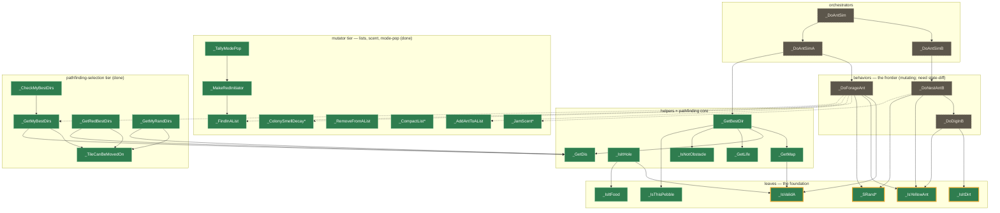

# simant_port

A byte-exact reverse-engineering port of **Maxis SimAnt**, built on
[`win16_re`](win16_re) (the game-agnostic Win16 reverse-engineering framework, vendored
here as a git submodule), which itself is built on [`dos_re`](win16_re/dos_re) (the
8086/80186 VM, vendored inside `win16_re`).

A Win16 game runs inside a software 8086/80186 VM where the operating system is
a *Python hook layer*: every Windows API SimAnt imports (KERNEL / USER / GDI /
SOUND / MMSYSTEM / …) resolves to a hooked thunk serviced in Python, and
individual hot ASM routines are replaced with verified Python
reimplementations. The original binary stays the source of truth — a hooked run
is only accepted when it reproduces the original's behaviour **byte-for-byte**.

## The layers

| Layer | What it is |
|-------|-----------|
| `win16_re/` | Git submodule: the **game-agnostic** Win16 framework — NE loader, the selector-based memory model, the full Win16 API surface, windowing, dialogs, menus, palette/DIB rendering, audio, demos, snapshots. Knows nothing about SimAnt. Itself vendors `dos_re/` as a nested submodule. |
| `simant/` | This project's game package: the adapter (`runtime`, `_env`), recovered logic (`recovered/`), lifted islands (`hooks.py`), profiler + symbol lookup (`probes/`), and `tests/`. |
| `scripts/` | `play.py` (play interactively — real window, keyboard, mouse, audio, `--resume`; the dos_re hotkeys: F10 screenshot, F11 demo-record toggle, F12 snapshot), `boot.py` (bring-up frontier probe), `replay.py` (headless demo replay, `--from-snapshot` for anchored demos). |

All SimAnt-specific knowledge lives in `simant/`; `win16_re/` never imports from
it.

## Recovery map

SimAnt's simulation is a call tree: colony **orchestrators** drive per-ant
**behaviors**, which lean on shared **helpers** and, at the bottom, small **leaf**
predicates and RNG. Recovery proceeds bottom-up — the whole foundation is byte-exact:
the leaf predicates and RNG, the map/life-grid query family, **the pathfinding
core** (`_GetBestDir` and the helpers it composes), **and now a full mutator tier**
— ant-list CRUD (find/add/set/remove/compact, all three colonies), the
scent/pheromone system (NEST linear decay, TRAIL exponential decay, jam, single-cell
read/decrement), and the mode-population/red-initiator subsystem
(`_ClrModePop`/`_TallyModePop`/`_MakeRedInitiator`, including a genuine
mutator-calling-mutator chain). Those needed a **state-diff oracle** (snapshot → run
recovered logic on a copy of the pre-state → diff against the ASM's mutation)
instead of the return-value oracle the foundation was built with. What remains is
the top two layers — the per-ant **behaviors** (`_DoForageAnt`, `_DoNestAntB`,
`_DoDigInB`) and the **orchestrators** above them, which compose the now-recovered
mutator tier. The graph below is a real slice of the `seg5`/`seg6`/`seg7` call
graph (every edge is an actual call); green nodes are proven byte-exact against the
original ASM, an amber ring marks the most-called routines, dashed nodes are the
not-yet-recovered frontier.



Coverage by segment — named routines proven byte-exact (an island + A/B oracle):

| Segment | Module | Role | Recovered | Status |
|---------|--------|------|:---------:|--------|
| `seg5` | SIMONE | sim primitives — map/life query, RNG, predicates, geometry | 58 / 169 | foundation **done** |
| `seg6` | SIMANT1 | ant AI — lists/scent/mode-pop/pathfinding **done**; forage/dig/nest behaviors frontier | 32 / 123 | selection tier **done** |
| `seg7` | SIMTWO | world sim + tile rendering + event loop | 4 / 282 | mostly rendering |
| `seg4` | `_TEXT` | C runtime + tile expanders (MakeTable / Xfer) | 23 / 248 | hot paths lifted |

The recovered routines are deliberately the load-bearing ones — `_SRand1` has 88
callers, `_SRand8` 71, `_win_IsWinOpen` 67, `_win_GetObjRect` 50, `_IsYellowAnt` 28,
`_IsValidA` 26, `_GetDir` 17, `_FindInAList` 16, `_IsItDirt` 15, `_GetDis` 15,
`_FindInBList` 15. Regenerate the underlying call-graph data with
`python -m simant.probes.callgraph`.

**What's done vs. what's missing.** The whole bottom is byte-exact: the leaf
predicates + RNG, the map/life-grid query family (`_GetMap`, `_IsItHole`,
`_IsClearTile`, `_IsNotObstacle`, `_IsItDigable`, `_IsValidLocation`, …), the
geometry (`_GetDir`, `_GetDis`), the pathfinding core `_GetBestDir`, and — new this
round — the mutator tier a behavior routine needs to actually act: ant-list CRUD
(`_FindInAList`/`_AddAntToAList`/`_RemoveFromAList`/`_CompactListA`, plus the B/R
colony twins), the scent/pheromone grids (`_ColonySmellDecayBN/RN/BT/RT`,
`_JamScentBN/RN/BT/RT`, `_AlarmHere`, `_DecTSmell`, `_GetSmellT`, `_FillHolesBN/RN`),
and the mode-population/red-initiator subsystem (`_ClrModePop`, `_TallyModePop`,
`_MakeRedInitiator`, `_KillTailB/R`, `_DropFoodB/R`, `_DrownBList/RList`,
`_KillSpider`, `_SetAntIndex`). Also new: the full **pathfinding-selection
tier** above `_GetBestDir` — `_TileCanBeMovedOn` (the movement/self-exclusion
predicate `_GetMyBestDirs`/`_GetRedBestDirs` share), `_GetMyBestDirs` /
`_GetRedBestDirs` (yellow-ant and red-colony neighbour selection), and the two
routines that compose them — `_GetMyRandDirs` (stateful sticky-direction
search across ticks via far-pointer in/out state) and `_CheckMyBestDirs`
(walks up to 64 steps toward a target). Missing is the per-ant **behavior
tier** in `seg6` (`_DoForageAnt`, `_DoNestAntB`, `_DoDigInB`, `_DoAntSim*`)
that composes all of this into an actual decision, the movement-EXECUTION
chain (`_TryMoveDirB/R` -> `_GetOutB/R` -> the dig subsystem), and combat
(`_YellowFight`/`_GetWinner`). That's the next milestone toward the
[VM-less native port](docs/vmless_port.md).

### What gets lifted vs. what gets replaced

The endgame is a **VM-less native port** (see [`docs/vmless_port.md`](docs/vmless_port.md)):
the emulator becomes an oracle, and recovered source runs the game directly. That
makes the game/backend boundary the thing that matters, and there are two:

- **The Win16 OS layer** (`win16_re/` — KERNEL/USER/GDI/SOUND/MMSYSTEM, the VM,
  windowing, audio) is the backend. A native port *replaces* it wholesale; nothing
  here is "lifted".
- **Inside the game**, each routine is either **core** (the deterministic
  simulation a native backend must run byte-exact — ant AI, map/life grids, RNG),
  **presentation** (tile expanders, the window system, the editor UI — a native
  backend *reimplements* these), or **runtime** (C-runtime/codec helpers the
  language provides). The litmus test: *simulation decides where the ants are and
  what they choose; presentation decides how that looks.*

So the honest native-port metric is **core routines recovered**, not the flat island
count — presentation islands (recovered early because they were hot) are workbench
scaffolding a native backend discards. `python -m simant.probes.callgraph` reports it:

| Role | Recovered / total | In the native port |
|------|:-----------------:|--------------------|
| **core** | **33 / 583** | runs unchanged — *the denominator* |
| presentation | 18 / 490 | reimplemented natively |
| runtime | 9 / 240 | provided by Python |

## Setup

```
git clone --recurse-submodules <this repo>
# or, if already cloned:
git submodule update --init --recursive
```

## Running the game

```
python scripts/play.py --scale 2                              # play it
python scripts/play.py --resume artifacts/snapshots/<snap>     # resume a snapshot
python scripts/boot.py [max_steps]                             # bring-up frontier report
```

`play.py` mirrors each Win16 window as a real OS window and reports every error
to the console (the game itself only needs the user to provide input).

## Working principles

- **Fail loud, never fake.** An unimplemented API / opcode / DOS service stops
  with a named frontier rather than guessing — the honest bring-up report.
- **Never weaken an oracle to make a slice pass.** The byte-exact proof is the
  value. A lifted hook is only accepted when an A/B run (original ASM vs. Python
  replacement) is pixel- and state-identical.
- **Game logic stays VM-free**; the VM/hook machinery stays in `win16_re/`.

## Status

Live bring-up notes and the standing-mechanisms registry are in
[`docs/run_status.md`](docs/run_status.md). The test suite is the
gate — run `python -m pytest -q` before any commit; never commit red.
