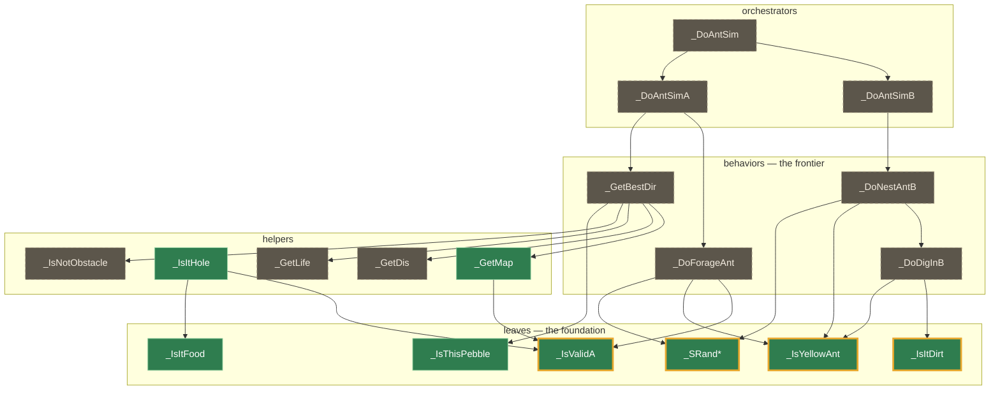

# simant_port

A byte-exact reverse-engineering port of **Maxis SimAnt**, built on
[`win16_re`](win16_re) (the game-agnostic Win16 reverse-engineering framework, vendored
here as a git submodule), which itself is built on [`dos_re`](win16_re/dos_re) (the
8086/80186 VM, vendored inside `win16_re`).

A Win16 game runs inside a software 8086/80186 VM where the operating system is
a *Python hook layer*: every Windows API SimAnt imports (KERNEL / USER / GDI /
SOUND / MMSYSTEM / …) resolves to a hooked thunk serviced in Python, and
individual hot ASM routines are replaced with verified Python
reimplementations. The original binary stays the source of truth — a hooked run
is only accepted when it reproduces the original's behaviour **byte-for-byte**.

## The layers

| Layer | What it is |
|-------|-----------|
| `win16_re/` | Git submodule: the **game-agnostic** Win16 framework — NE loader, the selector-based memory model, the full Win16 API surface, windowing, dialogs, menus, palette/DIB rendering, audio, demos, snapshots. Knows nothing about SimAnt. Itself vendors `dos_re/` as a nested submodule. |
| `simant/` | This project's game package: the adapter (`runtime`, `_env`), recovered logic (`recovered/`), lifted islands (`hooks.py`), profiler + symbol lookup (`probes/`), and `tests/`. |
| `scripts/` | `play.py` (play interactively — real window, keyboard, mouse, audio, `--resume`; the dos_re hotkeys: F10 screenshot, F11 demo-record toggle, F12 snapshot), `boot.py` (bring-up frontier probe), `replay.py` (headless demo replay, `--from-snapshot` for anchored demos). |

All SimAnt-specific knowledge lives in `simant/`; `win16_re/` never imports from
it.

## Recovery map

SimAnt's simulation is a call tree: colony **orchestrators** drive per-ant
**behaviors**, which lean on shared **helpers** and, at the bottom, small **leaf**
predicates and RNG. Recovery proceeds bottom-up — the load-bearing foundation is
byte-exact, and the frontier is now the behavior layer that sits on top of it.
The graph below is a real slice of the `seg5`/`seg6`/`seg7` call graph (every edge
is an actual call); green nodes are proven byte-exact against the original ASM, an
amber ring marks the most-called routines, dashed nodes are not recovered yet.



Coverage by segment — named routines proven byte-exact (an island + A/B oracle):

| Segment | Module | Role | Recovered |
|---------|--------|------|:---------:|
| `seg5` | SIMONE | sim primitives — map, life-grid, RNG, predicates | 27 / 169 |
| `seg6` | SIMANT1 | ant AI — forage, dig, nest, fight behaviors | 2 / 123 |
| `seg7` | SIMTWO | world sim + tile rendering + event loop | 4 / 282 |
| `seg4` | `_TEXT` | C runtime + tile expanders (MakeTable / Xfer) | 23 / 248 |

The recovered routines are deliberately the load-bearing ones — `_SRand1` has 88
callers, `_IsYellowAnt` 28, `_IsValidA` 26, `_IsItDirt` 15, `_GetMap` 10. Regenerate
the underlying call-graph data with `python -m simant.probes.callgraph`.

## Setup

```
git clone --recurse-submodules <this repo>
# or, if already cloned:
git submodule update --init --recursive
```

## Running the game

```
python scripts/play.py --scale 2                              # play it
python scripts/play.py --resume artifacts/snapshots/<snap>     # resume a snapshot
python scripts/boot.py [max_steps]                             # bring-up frontier report
```

`play.py` mirrors each Win16 window as a real OS window and reports every error
to the console (the game itself only needs the user to provide input).

## Working principles

- **Fail loud, never fake.** An unimplemented API / opcode / DOS service stops
  with a named frontier rather than guessing — the honest bring-up report.
- **Never weaken an oracle to make a slice pass.** The byte-exact proof is the
  value. A lifted hook is only accepted when an A/B run (original ASM vs. Python
  replacement) is pixel- and state-identical.
- **Game logic stays VM-free**; the VM/hook machinery stays in `win16_re/`.

## Status

Live bring-up notes and the standing-mechanisms registry are in
[`docs/run_status.md`](docs/run_status.md). The test suite is the
gate — run `python -m pytest -q` before any commit; never commit red.
